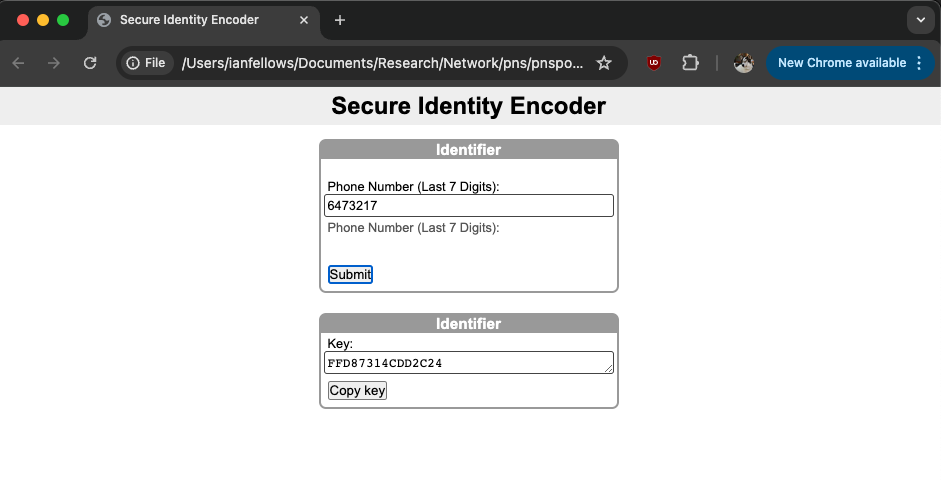

# Privatized Network Sampling (PNS): User Interface Documentation

While numerous methodologies exist to estimate proportions and means from an respondent driven sample (RDS), estimating population size is more challenging. A privatized network sample (PNS) is similar to an RDS, but also collects identifiers for each individual's network connections protecting privacy through the use of a hash function.

This package implements methods for estimating population size in PNS studies.

# Data

An RDS sampling process begins with the selection of a set of seed individuals from the population. Ideally these seeds would be randomly selected from the population, but this is not required. Information about these individuals is collected, including the number of connections they have to other members of the population (known as their degree or network size). They are then given a set of coupons to give to these connections in order to recruit them into the study. Their recruits are then enrolled in the study and are themselves asked to recruit other members of the population. This process proceeds until the sample size is reached.

Privatized network sampling (PNS) proceeds similarly to an RDS sample, except that individuals are asked the identities of their network connections (i.e. alters), which are then protected through the use of a hashing function. The number of network neighbors collected may be capped at a certain number (e.g. 10) to avoid overburdening the respondent.

# Choosing An Underlying Identifier

The underlying identifier is a piece (or series of pieces) of information that describes an individual nearly uniquely. The identifier must be known both by the individual and by social contacts that they have within the population of interest. The identifier need not be perfectly unique (i.e. multiple people can have the same identifier), however, the identifier should be chosen such that this occurs as rarely as possible.

A popular form of identifier is the last `X` digits of someone's phone number. This is a useful identifier because it is known by the individual and by those that the individual knows. An individual's contacts my not know it by heart, but they can often look it up on their own phones.

In some populations, people commonly have multiple phone numbers. Having multiple numbers breaks the uniqueness requirement of an identifier and so can be an issue that needs to be dealt with. In many populations we have found that while people may have multiple numbers, they only use one to communicate with members of the population of interest. For example, someone may have one phone for work, one personal phone and one to send mobile payments. It is thus important to obtain the number that is used with population members when eliciting the identifier (e.g. "What are the last 6 digits of the phone number you use most often to communicate with men who have sex with men?").

Using the full phone number is best from an analytical standpoint as it is fully unique; however, using fewer can be preferable for two reasons. First, it reduces data entry time. Second, it adds some "fuzzyness" to the identifier which can be an added layer of protection for a stigmatized or criminalized population. If an authority obtained the last 5 digits of a phone number known to belong to an injection drug user, they would not be able to easily use that information to find them.

Name initials are another identifier that can be used. Either the first letter of the person's first name, or both the first letters of the first and last name. Care should be taken in the population to assess that individuals know each other by first and last name, in which case both initials can be used. If people only know eachother by first name, then only the first initial can be used. If members of the population generally know each other by nickname, then initials cannot be used.

Initials themselves do not provide enough uniqueness to be used as an identifier as there are only 24*24=576 unique possible first and last name initials. For this reason it is recommended to use initials along with another identifier such as phone number digits.

It is recommended that the number of possible unique values for the identifier significantly exceeds the population size (>10X is recommended. >100X is ideal). For example, a 6 digit number results in 10^6 = 1,000,000 unique possibilities. First initial plus 4 digits of a phone number results in 240,000.

# Privatizing Identifiers Using Hash Functions

The identifiers may be protected through the use of a hash function. A hashing function is a one way function that transforms an identifier into a (semi-)unique string of characters. There are many different hash functions that can be used, including cryptographic hash functions like SHA-256. Using SHA-256 on the identifier 'Ian Fellows (555) 212-5364' results in the value '276a8cf8f0ea69943c737ff47565233b5314169eb6a4996da43b3a1acb293230'.

It is up to the study to determine how to integrate hashing into the data collection process, however, we have developed tools to make this as easy and seamless as possible.

## Via Webpage

A simple html web application is provided for hashing partial phone numbers and (optionally) initials. It can be accessed and downloaded from [https://github.com/fellstat/pnspop/blob/main/inst/shinyui/hasher.html](https://github.com/fellstat/pnspop/blob/main/inst/shinyui/hasher.html).

Edit the variables in the header for your particular study needs and then the file can either be hosted on a web server or loaded locally on the system used for data collection. Note that all computations are done on the client side, so if the file is hosted on a webserver, no information (including identifiers) is transmitted to the server.

aa

bb

